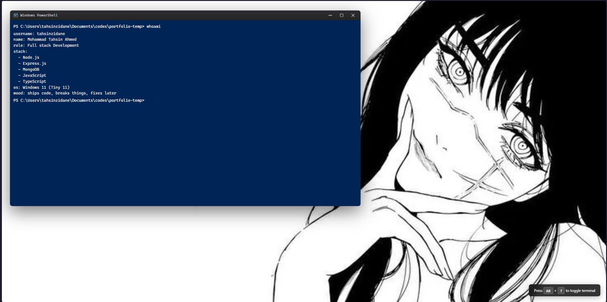

# PowerShell Terminal Portfolio

<div align="center">


A beautiful, interactive Windows PowerShell-inspired terminal interface for showcasing your portfolio and developer information in a unique, geek-friendly way.

[Features](#features) • [Demo](#demo) • [Installation](#installation) • [Usage](#usage) • [Customization](#customization) • [Contributing](#contributing)

</div>



---

## 🎯 Features

- **🖥️ Authentic PowerShell Interface** - Pixel-perfect recreation of Windows PowerShell terminal
- **⚡ Dynamic Command System** - JSON-based command configuration for easy customization
- **🎨 Fully Customizable** - Modify colors, fonts, and background without touching the code
- **⌨️ Keyboard Shortcuts** - Alt+T to toggle terminal visibility
- **📱 Responsive Design** - Works seamlessly on desktop, tablet, and mobile devices
- **🪟 Window Controls** - Functional minimize, maximize, and close buttons
- **🖱️ Draggable Window** - Click and drag the title bar to reposition
- **📜 Command History** - Navigate previous commands with arrow keys
- **✨ Smooth Animations** - Polished transitions and blinking cursor effect
- **🔧 No Dependencies** - Pure vanilla JavaScript, no frameworks required

## 📸 Demo

```bash
PS C:\Users\tahsinzidane\Documents\codes\portfolio-temp> whoami
username: tahsinzidane
name: Mohammad Tahsin Ahmed
role: Full stack Development
stack:
  - Node.js
  - Express.js
  - MongoDB
  - JavaScript
  - TypeScript
os: Windows 11 (Tiny 11)
mood: ships code, breaks things, fixes later
PS C:\Users\tahsinzidane\Documents\codes\portfolio-temp>

```

## 🚀 Installation

### Quick Start

1. **Clone the repository**
   ```bash
   git clone https://github.com/tahsinzidane/powershell-terminal-portfolio.git
   cd powershell-terminal-portfolio
   ```
3. **Open in browser**
 `open with live server`


## 📖 Usage

### Available Commands

The terminal comes with several pre-configured commands:

| Command | Description |
|---------|-------------|
| `whoami` | Display user information and tech stack |
| `pwd` | Show current directory path |
| `ls` | List all projects |
| `cat portfolio.txt` | Display social media links |
| `git status` | Show git repository status (with humor!) |
| `npm list -g` | List globally installed packages |
| `history` | Show command history and achievements |
| `echo $GOAL` | Display personal goal/motto |
| `top` | Show system resource usage (creatively) |
| `uptime` | Display coding journey timeline |
| `exit` | Logout message |
| `help` | Show all available commands |

### Built-in Commands

| Command | Description |
|---------|-------------|
| `cls` / `clear` | Clear terminal screen |
| `date` | Show current date |
| `time` | Show current time |
| `echo [text]` | Print text to terminal |

### Keyboard Shortcuts

| Shortcut | Action |
|----------|--------|
| `Alt + T` | Toggle terminal visibility |
| `↑` Arrow Up | Navigate to previous command |
| `↓` Arrow Down | Navigate to next command |
| `Enter` | Execute command |

### Window Controls

- **Minimize (—)**: Minimize terminal to bottom of screen
- **Maximize (⬜)**: Toggle fullscreen mode
- **Close (×)**: Hide terminal (use Alt+T to reopen)
- **Drag**: Click and hold title bar to move window

## 🎨 Customization

### Modifying Commands

Edit `terminalData.json` to customize your terminal responses:

```json
{
  "whoami": {
    "username": "your-username",
    "name": "Your Full Name",
    "role": "Your Role",
    "stack": ["Tech1", "Tech2", "Tech3"]
  },
  
  "custom-command": "Your custom response here",
  
  "nested-command": {
    "key1": "value1",
    "key2": ["array", "of", "values"]
  }
}
```

#### Command Response Types

**1. Simple String Response:**
```json
{
  "pwd": "/home/user/projects"
}
```

**2. Object Response (formatted output):**
```json
{
  "whoami": {
    "username": "tahsin",
    "role": "Developer"
  }
}
```

**3. Array Response (numbered list):**
```json
{
  "npm list -g": ["node", "npm", "typescript"]
}
```

**4. Multi-line Response:**
```json
{
  "help": "Line 1\nLine 2\nLine 3"
}
```

### Changing Appearance

#### Background Image
In `styles.css`, modify the background:
```css
.container {
    background-image: url("your-image-url.jpg");
}
```

#### Colors
Change the PowerShell blue theme:
```css
.terminal-window {
    background-color: #012456; /* PowerShell blue */
}
```

#### Font
Update the terminal font:
```css
body {
    font-family: 'Your-Font', 'Cascadia Code', monospace;
}
```

#### Terminal Size
Adjust terminal dimensions in `styles.css`:
```css
.terminal-window {
    height: 65vh;  /* Change height */
    width: 58vw;   /* Change width */
}
```

### Prompt Customization

Modify the prompt text in `index.html` and `script.js`:
```html
<span class="prompt">PS C:\Your\Custom\Path&gt;</span>
```

## 🛠️ Advanced Usage

### Adding Custom Commands

1. **Simple Command:**
   ```json
   {
     "skills": "HTML, CSS, JavaScript, React, Node.js"
   }
   ```

2. **Command with Spaces:**
   ```json
   {
     "git log": "commit abc123: Initial commit\ncommit def456: Added features"
   }
   ```

3. **Interactive Response:**
   ```json
   {
     "projects": {
       "total": 15,
       "featured": ["Project A", "Project B", "Project C"]
     }
   }
   ```

### Integration Tips

**Add to Portfolio Website:**
```html
<!-- Include in your main page -->
<iframe src="terminal/index.html" width="100%" height="600px"></iframe>
```

**Embed as Section:**
Copy the terminal HTML structure directly into your portfolio's main page.

## 🤝 Contributing

Contributions are always welcome! Here's how you can help:

1. Fork the repository
2. Create your feature branch (`git checkout -b feature/AmazingFeature`)
3. Commit your changes (`git commit -m 'Add some AmazingFeature'`)
4. Push to the branch (`git push origin feature/AmazingFeature`)
5. Open a Pull Request

### Areas for Contribution

- [ ] Add more built-in commands
- [ ] Implement tab completion
- [ ] Add command suggestions
- [ ] Create themes (dark mode variations)
- [ ] Improve mobile responsiveness
- [ ] Add sound effects
- [ ] Multi-language support


## 📝 License

This project is licensed under the MIT License - see the [LICENSE](LICENSE) file for details.

## 👨‍💻 Author

**Mohammad Tahsin Ahmed**
- Website: [tahsinzidane](https://tahsinzidane.github.io/)

## 🙏 Acknowledgments

- Inspired by Windows PowerShell and Unix terminals
- Font: [Cascadia Code](https://github.com/microsoft/cascadia-code) by Microsoft
- Icons: SVG icons for window controls

## 💡 Ideas & Inspiration

This project was built to:
- Showcase technical skills in a creative way
- Provide a unique portfolio experience
- Learn about DOM manipulation and event handling
- Have fun with retro-computing aesthetics


<div align="center">

**[⬆ Back to Top](#powershell-terminal-portfolio)**

Made with ❤️ and ☕ by [Tahsin Zidane](https://github.com/tahsinzidane)

If you found this helpful, consider giving it a ⭐!

</div>